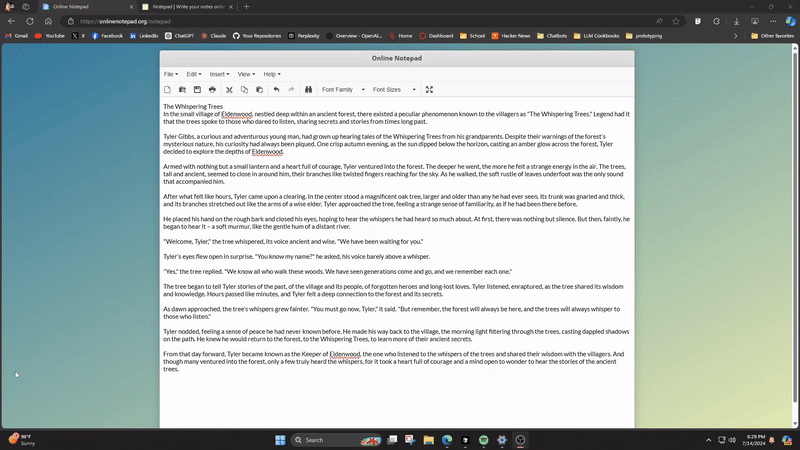

# GestureFlow

GestureFlow: A application that enhances right-click functionality with a customizable radial menu for quick access to common actions, activated by holding the right mouse button.



## Running the Project

You can run the project in two ways:

1. **Run from Source:**
   - Install all the requirements (preferably in a virtual environment):
     ```sh
     pip install -r requirements.txt
     ```
   - Run the `gestureflow.py` file:
     ```sh
     python gestureflow.py
     ```

2. **Run the Executable:**
   - Download the pre-built executable from the `dist` folder.
   - Double-click the executable to run it.

## Building the Executable

To build the executable yourself:

1. Install PyInstaller:
   ```sh
   pip install pyinstaller
   ```

2. Run the following command in the project directory:
   ```sh
   python -m PyInstaller --onefile --windowed "gestureflow.py"
   ```

3. Find the generated executable in the `dist` folder.

**Note:** If you encounter any issues with PyQt6, you can exclude it from the build.

Additionally, a pre-built executable is included in the `dist` folder for your convenience.

## Contributing

We welcome contributions from the community! If you have any ideas, suggestions, or bug reports, please feel free to open an issue or submit a pull request. Your contributions are greatly appreciated!